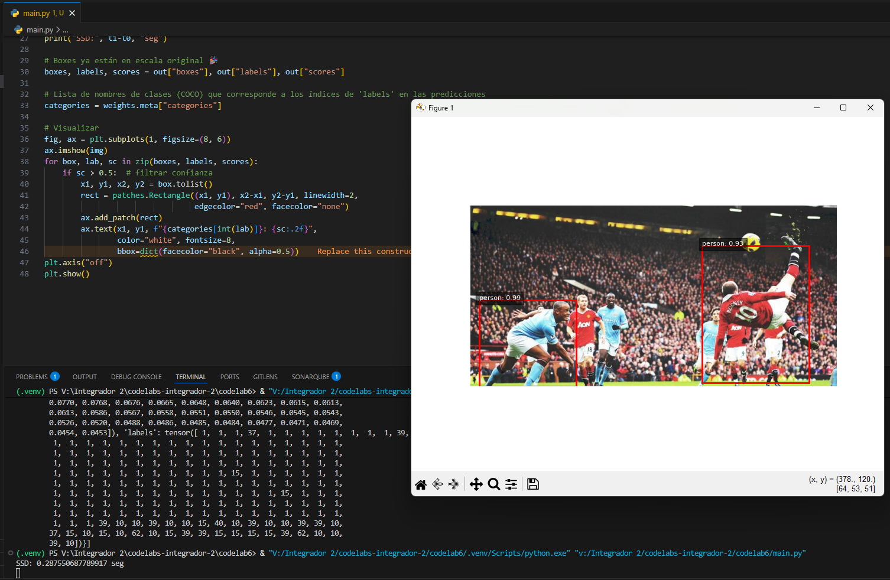
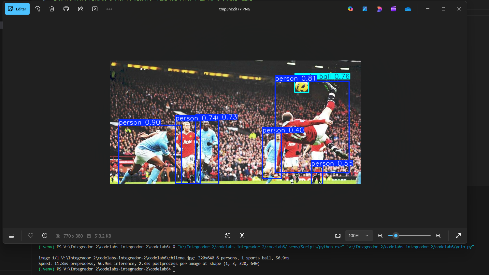
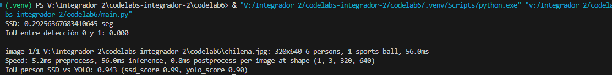
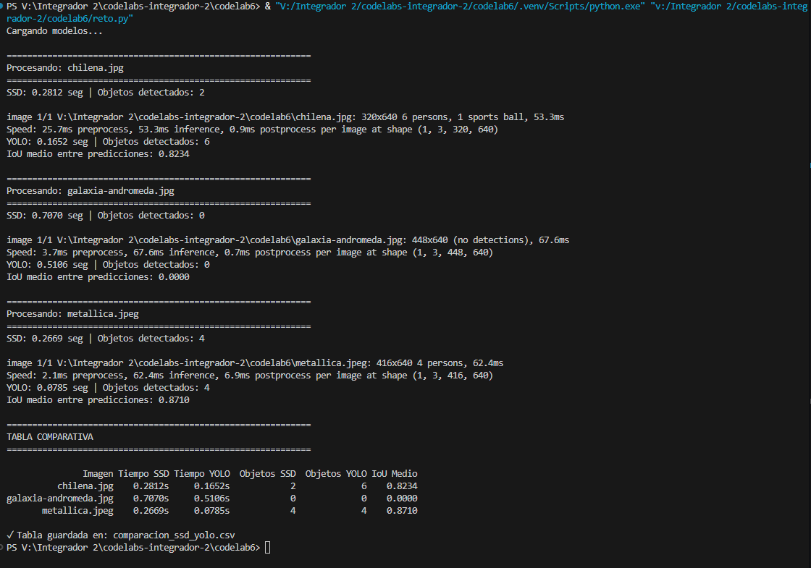

# Comparacion
En cuanto a SSD, vemos que tuvo peor resultado en cuanto a tiempo y deteccion de personas y objetos

Mientras que YOLO-Lite tuvo un mejor rendimiento en ambos aspectos

Comparacion IoU  
  

# Reto
Segun la tabla comparativa, deberiamos escoger el modelo YOLO, ya que tiene un mejor rendimiento en cuanto a tiempo y deeteccion de objetos.  

